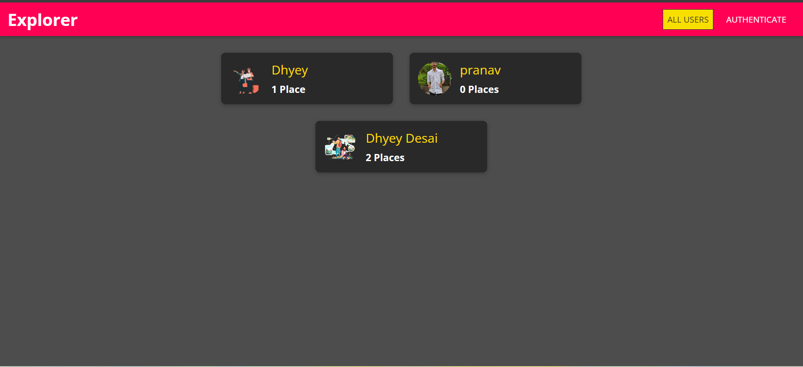
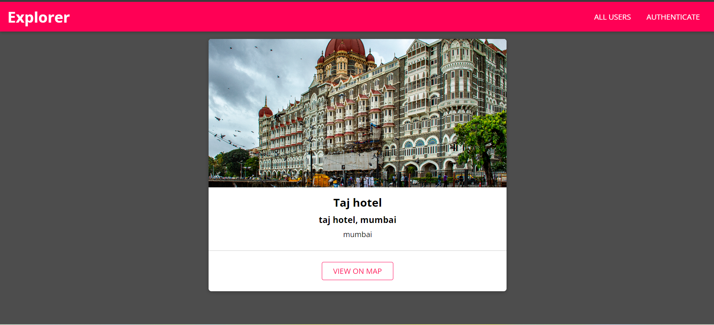
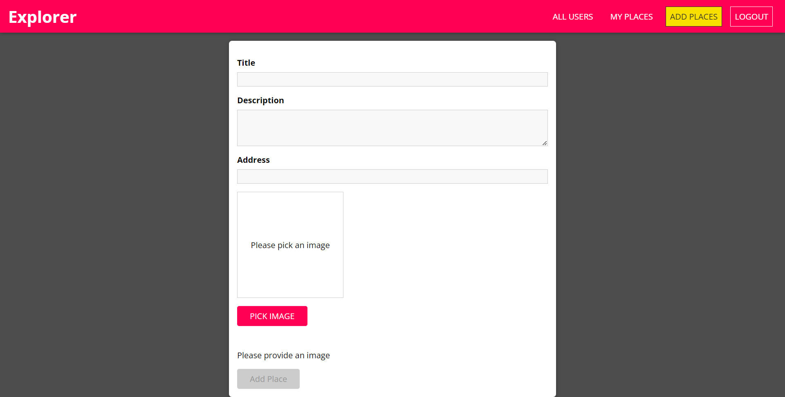
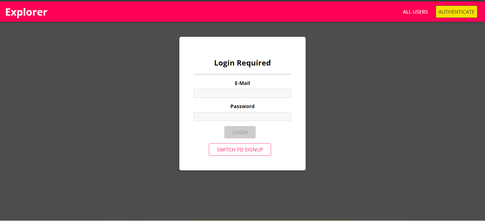
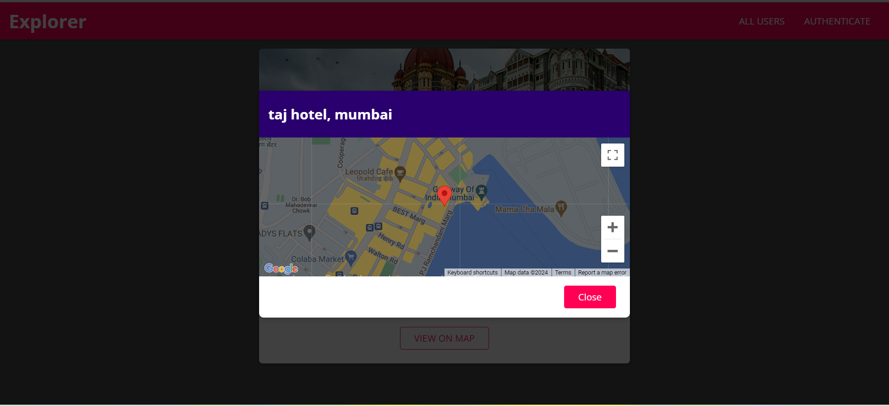

# Place Explore Web Application

Welcome to the Place Explore Web Application! This platform allows users to discover and share information about different places. Users can explore posts made by others, view locations on Google Maps, and contribute their own posts after registering.

## Features

- **Explore Posts**: Users can browse through posts about various places made by other users.
- **View Location on Google Maps**: Each post includes a location displayed on Google Maps for easy navigation.
- **User Registration**: Users can register themselves to create and share their own posts about new places.
- **User Authentication**: Secure authentication system ensures that only registered users can create posts.
- **Responsive Design**: The application is designed to be responsive, ensuring a seamless experience across devices.

## Installation

To run the application, follow these steps:

1. Clone this repository to your local machine.
2. Navigate to the project directory.
3. Install dependencies for the frontend using `cd frontend` and `npm install`.
4. Install dependencies for the backend using `cd backend` and `npm install`.
5. Start the backend server using `node app.js`.
6. Start the frontend server using `npm start`.
7. Access the application in your web browser at `http://localhost:3000`.

## Technologies Used

- **React.js**: JavaScript library used for building the frontend user interface.
- **Node.js**: JavaScript runtime environment for server-side scripting.
- **Express**: Web application framework for Node.js used for building the backend.
- **MongoDB**: NoSQL database used for storing user and post data.
- **Google Maps API**: Used to display locations on Google Maps.
- **HTML/CSS**: Frontend markup and styling.

## Screenshots

    
    
    
    
    

## License

This project is licensed under the [MIT License](LICENSE).

## Support

For any inquiries or support, please contact [dhyey870@gmail.com](mailto:dhyey870@gmail.com).
